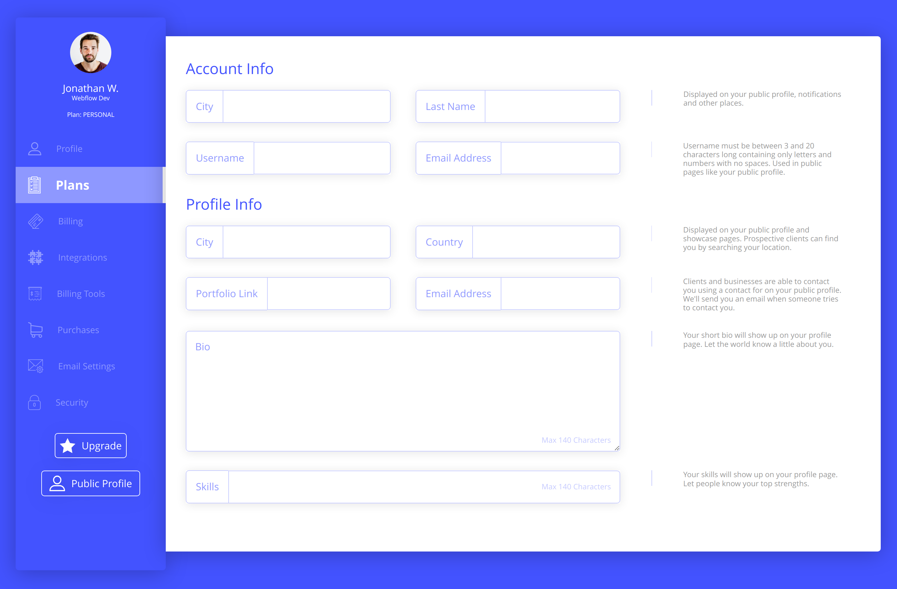

# Account Settings

Тестовое задание по вёрстке HTML + CSS.

[Страница на GitHub Pages](https://gvozdenkov.github.io/ui-challenge-account-settings/)

## Описание

1. CSS стили написаны по [БЭМ](https://ru.bem.info/methodology/css/)
2. Использовал семантику блоков формы `fieldset`
3. Расстановка элементов с помощью `Grid`, минимизация лишних обёрток
